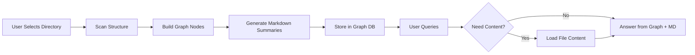

# Local Knowledge Graph

> A graph-first local knowledge system with LLM-powered structural understanding

## Overview

This project builds a graph-based knowledge system that understands the **structure** of your local file system before reading its content. It creates a layered knowledge graph where:

1. **Layer 1** - File tree structure ("what exists")
2. **Layer 2** - Markdown node summaries ("what it's about")
3. **Layer 3** - Original file content ("what it says")

The system uses knowledge graph as the primary memory structure, not embedding-based retrieval. When you need to dive deeper, it loads file content on-demand along graph paths.

### Why This Approach?

- **Structure-first**: Understands organization before content
- **Graph-native**: Uses knowledge graph, not vector search
- **Privacy-first**: Runs in confidential AI runtime (TEE/Tinfoil)
- **Obsidian-like**: Graph view + Markdown nodes + layer-by-layer knowledge construction
- **On-demand access**: File content loaded only when explicitly requested

## Architecture

### Three-Layer Design

```
┌─────────────────────────────────────────────────────────────┐
│ Layer 3: Original Files (Deep Evidence)                    │
│         - Actual file contents                              │
│         - Loaded on-demand only                              │
│         - Accessed via graph paths                          │
└─────────────────────────────────────────────────────────────┘
                            ↑
┌─────────────────────────────────────────────────────────────┐
│ Layer 2: Markdown Nodes (Semantic Index)                    │
│         - Node summaries (path, tags, relationships)        │
│         - AI and human readable                             │
│         - Fast navigation without reading content            │
└─────────────────────────────────────────────────────────────┘
                            ↑
┌─────────────────────────────────────────────────────────────┐
│ Layer 1: File Tree (Structural Map)                         │
│         - Directory hierarchy                               │
│         - File names, types, timestamps                      │
│         - Scanned by default                                 │
└─────────────────────────────────────────────────────────────┘
```

### Technology Stack

| Component | Technology | Reason |
|-----------|-----------|--------|
| **Language** | TypeScript | Type safety, great tooling |
| **Graph Database** | Memgraph (Neo4j-compatible) | Lightweight, Cypher query, TypeScript driver |
| **LLM** | Tinfoil (TEE runtime) | Confidential execution, attestation |
| **API** | Fastify/Express | REST API for backend |
| **Frontend** | React + TypeScript | Interactive graph view |
| **Graph Visualization** | Cytoscape.js / React Flow | Interactive graph exploration |
| **Markdown Generation** | LLM API | Automated node summaries |

### Data Flow



## MVP Scope

### 7-Step Minimum Viable Product

1. **Directory Selection**: User manually selects a local subdirectory
2. **Structure Scanning**: Scan directory tree and file metadata
3. **Graph Construction**: Convert directories and files to graph nodes and edges
4. **Markdown Generation**: Auto-generate Markdown node file for each node
5. **Graph View & Q&A**: Provide interactive graph visualization and chat interface
6. **Structure-Based Queries**: Answer questions using only graph + Markdown nodes
7. **On-Demand Deep Access**: Load original file content when user clicks and confirms a node

### What MVP Does NOT Do (Yet)

- ❌ Embedding-based retrieval (graph traversal only)
- ❌ Automatic file content reading
- ❌ Conflict management / version control
- ❌ Conversation memory integration
- ❌ Cross-device sync
- ❌ Real-time monitoring (screen, microphone, etc.)

## Graph Schema

### Node Types

| Node Type | Properties | Example |
|-----------|-----------|---------|
| `Directory` | `path`, `name`, `depth`, `created_at`, `modified_at` | `~/Documents/Projects` |
| `File` | `path`, `name`, `extension`, `size`, `created_at`, `modified_at` | `index.ts` |
| `Project` | `name`, `type`, `inferred_from` | "Trading System" |
| `Module` | `name`, `belongs_to` | "API Layer" |

### Edge Types

| Edge Type | From → To | Meaning |
|-----------|-----------|---------|
| `CONTAINS` | Directory → Directory/File | Hierarchy |
| `PART_OF` | File → Project | Semantic grouping |
| `RELATED_TO` | File → File | Similarity or reference |
| `DEPENDS_ON` | File → File | Import/dependency |

### Markdown Node Format

Each node has a Markdown representation:

```markdown
# Node: [File/Directory Name]

## Path
`/absolute/path/to/node`

## Type
File / Directory

## Properties
- Extension: .ts
- Size: 24KB
- Last Modified: 2026-03-21

## Relationships
- Contains: [child files]
- Part of: [Project X]
- Related to: [File A, File B]

## Inferred Purpose
[Brief LLM-generated summary of what this node might be]

## Tags
trading, api, backend, core

## Quick Access
→ Load content (on-demand)
```

## Usage

### Setup

```bash
# Clone repo
git clone https://github.com/YusenFan/local-knowledge-graph.git
cd local-knowledge-graph

# Install dependencies
npm install

# Start Memgraph (Docker)
docker run -d -p 7687:7687 -p 7444:7444 memgraph/memgraph-platform

# Start backend
npm run backend

# Start frontend
npm run frontend
```

### Workflow

1. **Select Directory**: Choose a directory to analyze
2. **Scan**: System scans structure and builds graph
3. **Explore**: Interactive graph view
4. **Query**: Ask questions about your project structure
5. **Deep Dive**: Click nodes to load content when needed

### Example Queries

- "What modules are in my trading system project?"
- "Which subdirectory looks like research work vs product prototype?"
- "Where should I start if I want to find trading-related files?"
- "Show me all TypeScript files in the API layer"

## Roadmap

### Phase 1: MVP (Current)
- ✅ Directory scanning and graph construction
- ✅ Markdown node generation
- ✅ Graph visualization
- ✅ Basic structure-based Q&A

### Phase 2: Enhanced Structure Understanding
- [ ] Entity extraction (projects, modules, tasks)
- [ ] Relationship inference
- [ ] Time-based analysis (project evolution)

### Phase 3: Content Integration
- [ ] Selective content reading
- [ ] Code semantic analysis
- [ ] Documentation summarization

### Phase 4: Extended Memory
- [ ] Conversation memory integration
- [ ] Cross-device file sync
- [ ] User profile generation

### Phase 5: Advanced Features (Future)
- [ ] Real-time monitoring (screen, microphone)
- [ ] Multi-modal inputs
- [ ] Collaborative knowledge sharing

## Privacy & Security

### Confidential AI Runtime

This system is designed to run in **Trusted Execution Environment (TEE)** using confidential computing frameworks like **Tinfoil**:

- **Attestation**: Verify code authenticity before execution
- **Confidentiality**: Data remains encrypted in memory
- **Verifiable Privacy**: Cryptographic proof of private processing

### Data Handling

- ✅ Local-only processing
- ✅ No cloud transmission of file content
- ✅ Explicit authorization required for directory access
- ✅ On-demand content loading (not by default)

## Contributing

Contributions welcome! Please read [CONTRIBUTING.md](CONTRIBUTING.md) for guidelines.

## License

MIT License - see [LICENSE](LICENSE) for details.

## Acknowledgments

- Inspired by Obsidian's graph view and knowledge management philosophy
- Memgraph for lightweight graph database
- Confidential AI / TEE community

---

**Built with ❤️ by Yusen**
